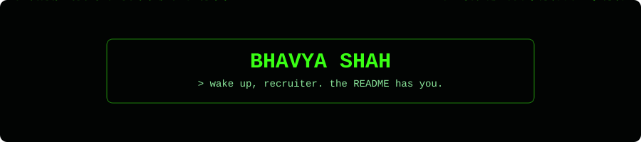
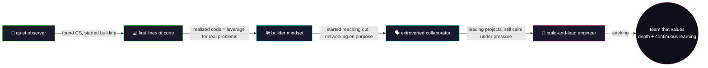
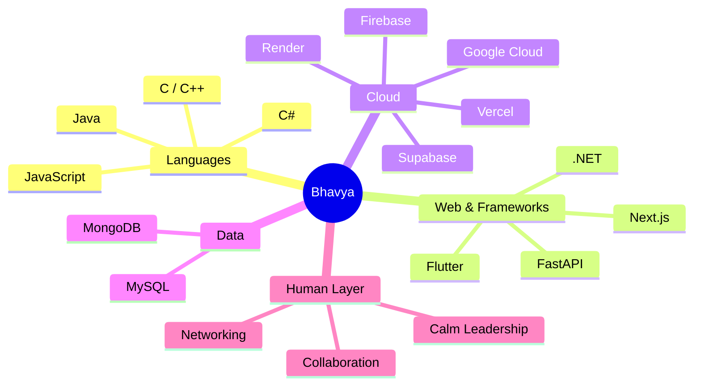

<div align="center">



</div>

<br>

<div align="center">

```
╔═══════════════════════════════════════════════════════════════╗
║  root@bhavya:~$ ./boot_sequence.sh                              ║
╚═══════════════════════════════════════════════════════════════╝
```


</div>

<br>

<details>
<summary>⚠️ <b>click only if you're not afraid of the truth</b></summary>
<br>

```
[SYSTEM LOG] unauthorized curiosity detected at line 1
[SYSTEM LOG] visitor opened a collapsed section. bold move.
[SYSTEM LOG] here's what they don't put in the LinkedIn bio:

  > I once debugged something for 6 hours.
  > The bug was a missing semicolon.
  > I have never fully recovered.
  > I am, however, still standing. And still shipping.
```

</details>

<br>

## `$ git log --oneline life.log`

```diff
+ commit 9f2a1e0 (HEAD -> main, origin/main)
+ Author: Bhavya Shah <sbhavya838@gmail.com>
+ Date:   ongoing
+
+     feat: became the calm professional who ships and leads
+
- commit 4c7b3d2
- Author: Bhavya Shah
- Date:   sophomore year
-
-     refactor(personality): quiet_observer -> extroverted_builder
-     BREAKING CHANGE: now thrives on networking + new people

  commit 1a0e9f4
  Author: Bhavya Shah
  Date:   freshman year

      init: started Computer Engineering degree, India
```

<br>

## 🧬 the origin story, as a graph



<br>

## `$ cat philosophy.md`

> best_code = f(real_world_human_problem)
> every_new_connection == gateway_to(fresh_knowledge, unique_perspective)
> currently_seeking: team.where(depth == True and learning == "continuous")

<br>

## 🧠 how the stack connects in my head



<br>

## `$ npm ls --depth=0 my-stack`

```json
{
  "name": "bhavya-shah",
  "version": "student-engineer",
  "dependencies": {
    "languages": ["C", "C++", "C#", "Java", "JavaScript"],
    "web": ["HTML5", "Node.js", "Next.js", "FastAPI", ".NET", "Flutter"],
    "cloud": ["Firebase", "Google Cloud", "Vercel", "Render", "Supabase"],
    "databases": ["MySQL", "MongoDB"]
  },
  "scripts": {
    "collaborate": "email sbhavya838@gmail.com",
    "connect": "open linkedin.com/in/bhavyashah272"
  }
}
```

<br>

## `$ ./run_diagnostics.sh --stats`

<div align="center">


</div>

<br>

## 🐍 `$ tail -f contribution_feed.log`


<div align="center">

</div>

<br>

## 🧾 auto-generated metrics dashboard

*(isocalendar heatmap, language breakdown, unlockable achievements — regenerated daily, also via Action)*

<div align="center">

</div>

<br>

## `$ fortune | cowsay`

<div align="center">

</div>

<br>

## `$ ./connect.sh --all`

<div align="center">

```
┌──────────────────────────────────────────┐
│  > choose your channel                    │
├──────────────────────────────────────────┤
```

[](https://instagram.com/bhavyashah272)
[](https://linkedin.com/in/bhavyashah272)
[](mailto:sbhavya838@gmail.com)

```
└──────────────────────────────────────────┘
```

<br>

`[ EOF ]` — you scrolled this far. that's already more effort than most recruiters. thanks for reading.

<br>

[](https://visitcount.itsvg.in)

</div>
